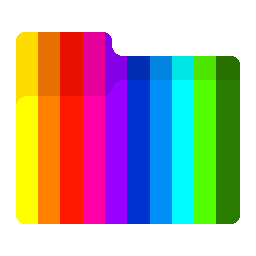
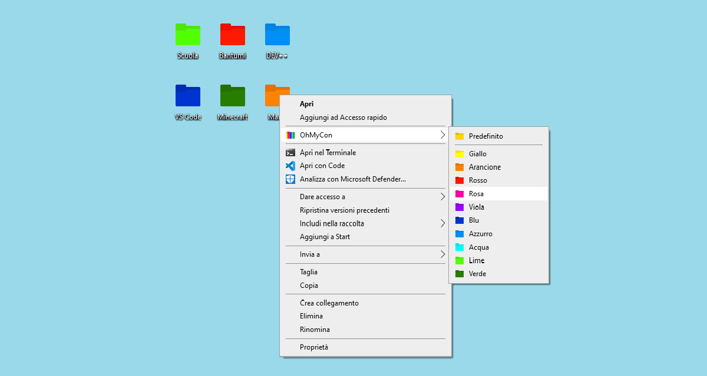

<div align="center">



# OhMyCon

🎨 Uno strumento per dare colore alle cartelle di Windows

· [Utilizzo](#utilizzo) ·
[Installazione](#installazione) ·
[Disinstallazione](#disinstallazione) ·
[Autore](#autore) ·
[Licenza](#licenza) ·

</div>


<br />

> ![CAUTION]
> STRUMENTO OBSOLETO!


# Utilizzo



> ⚠️ Riavviare `Explorer.exe`


# Installazione

1. Clonare la repository

2. Aprire un emulatore di terminale in modalità amministratore

3. Digitare:

    ```terminal
    install.vbs
    ```

4. Seguire la procedura


# Disinstallazione

1. Clonare la repository

2. Aprire un emulatore di terminale in modalità amministratore

3. Digitare:

    ```terminal
    uninstall.vbs
    ```

4. Seguire la procedura


# Autore

- [Luca Pollicino](https://github.com/reallukee)


# Licenza

Licenza [MIT](./LICENSE)
